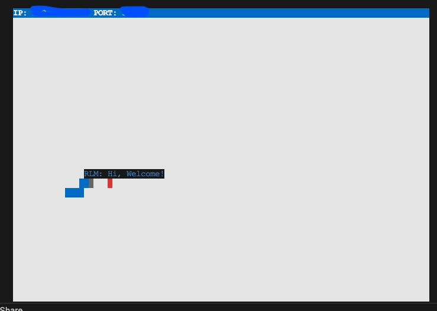
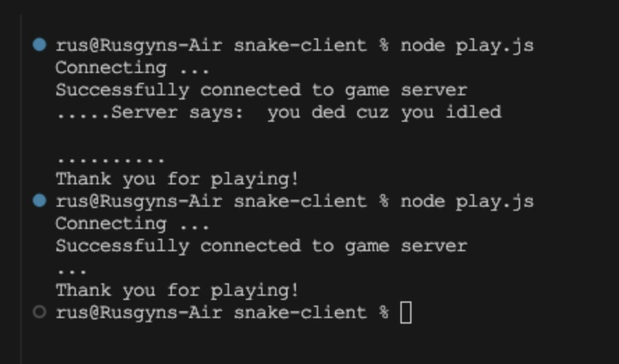

# Snake MultiPlayer Project - (client page)

Snake is a sub-genre of action video games where the player maneuvers the end of a growing line, often themed as a snake. 

The player must keep the snake from colliding with both other obstacles and itself, which gets harder as the snakes lengthen.
(Wikipedia)

## Description:

[Snake-Client](https://github.com/Rusgyn/snake-client) is a mini project, designed to teach us about networking whilst giving us the opportunity to review and use our knowledge of previously learned concepts (callbacks, asynchronous control flow, modules in node, writing modular code, refactoring code, working with stdin). Through the context of building out a part of a game that runs in the terminal, we will learn how to connect a client to a server using TCP. To do so, we will leverage Node’s net module. We will also develop our familiarity with asynchronous programming as we will create event handlers that will action in response to certain events, such as receiving data or creating a connection. It's not the most beautiful game, but it should be fun nonetheless. In doing this project, we will be set up for the next part of the module's learning about HTTP, as HTTP is the "language" that both client and server use to communicate over a TCP connection.

## Note

Ensure to run the server side before the client.

## Product

Snake Game - image



End-user Terminal - image



## Getting Started

### Executing the Program

1. Clone the repository [Snake-Client](https://github.com/Rusgyn/snake-client) to your local device/machine.
    For reference, see [github cloning a repository](https://docs.github.com/en/repositories/creating-and-managing-repositories/cloning-a-repository) steps.
2. Clone [the server](https://github.com/lighthouse-labs/snek-multiplayer) code and run it locally.
  ```
  git clone https://github.com/lighthouse-labs/snek-multiplayer.git
  cd snek-multiplayer
  ```
3. Install `npm`
  ```
  npm install
  npm run play
  ```
  - you may access the snek-multiplayer README file and follow the steps.
4. Run the development snake client using the `node play.js` command
5. Attempting to connect, a message pop up on client side *"Connecting ..."*.
6. Once connected, message *"Successfully connected to game server"* will pop op on client side.
7. Use the following keyboard keys:
  - **i. Snake movement**
    - w - for moving up 
    - a - for moving left
    - s - for moving down
    - d - for moving left
  - **ii. Snake canned messages**
    - z - for Hi, Welcome!
    - x - for Enjoy
    - c - for Cool
    - q - for Bye
  - **ii. Other keys**
    - ctrl + c - to exit or terminate the game session.
    - Any other keys, a "." will pop up on client side if presses a wrong key.
- When idled, bumped or hit the wall - a message pop up *"Server says:  you crashed, so you ded"*
- `Ctrl + C` are the only keys that quit your connection.
  -  Once exited, a message pop up *"Thank you for playing"*

## Message

<b>Have fun!</b>
