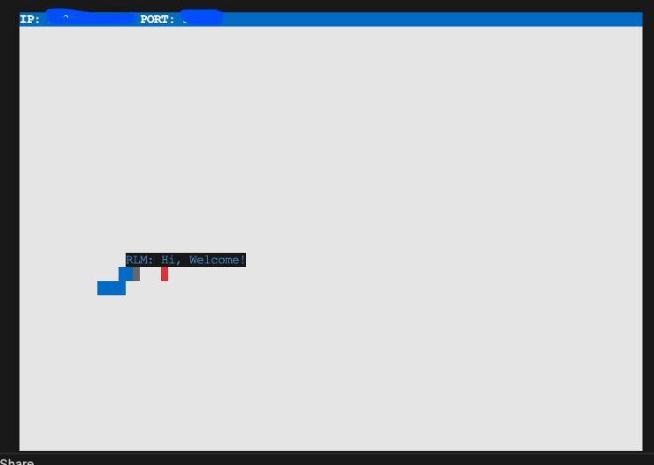
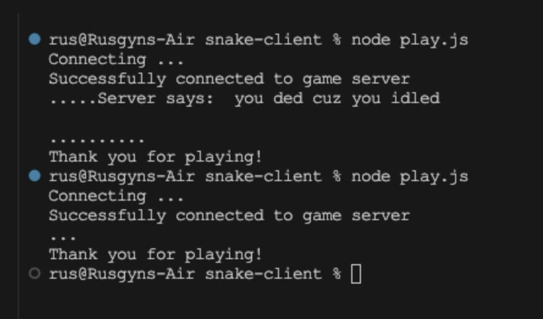

# Snake Client Project

Snake is a sub-genre of action video games where the player maneuvers the end of a growing line, often themed as a snake. 

The player must keep the snake from colliding with both other obstacles and itself, which gets harder as the snakes lengthen.
(Wikipedia)

## Note

Ensure to run the server side before the client.

## Product

## How to:

- Access the README file and follow the steps inside the snek server repo to run the server side.
- Run the development snake client using the `node play.js` command
- Attempting to connect, a message pop up on client side *"Connecting ..."*.
- Once connected, message *"Successfully connected to game server"* will pop op on client side.
- Use the following keyboard keys:
  - **i. Snake movement**
    - w - for moving up 
    - a - for moving left
    - s - for moving down
    - d - for moving left
  - **ii. Snake canned messages**
    - z - for Hi, Welcome!
    - x - for Enjoy
    - c - for Ok
    - q - for Bye
  - **ii. Other keys**
    - ctrl + c - to exit, a message will pop "Thank you for playing!" on client side.
    - Any other keys, a "." will pop up on client side.
- When idled, bumped or hit the wall - a message pop up *"Server says:  you crashed, so you ded"*
- `Ctrl + C` are the only keys that quit your connection.
- Once exited, a message pop up *"Thank you for playing"*

HAVE FUN AND ENJOY THE GAME!